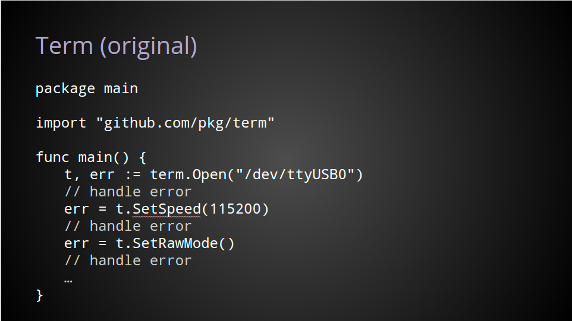
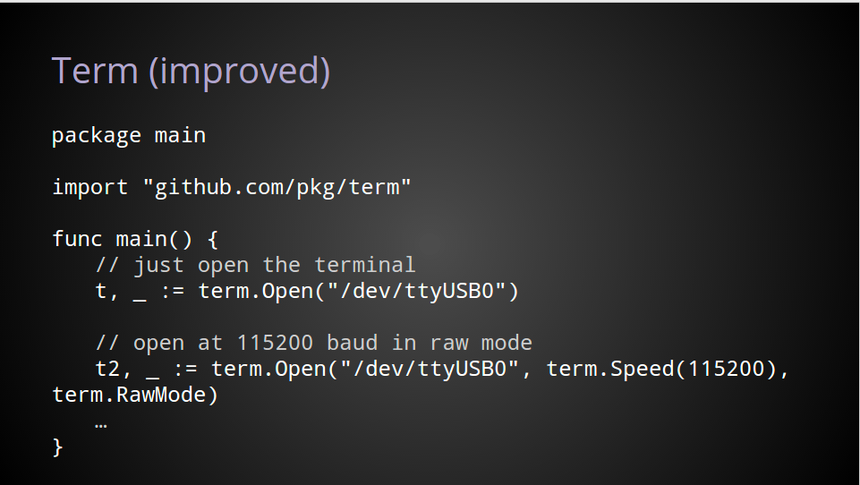
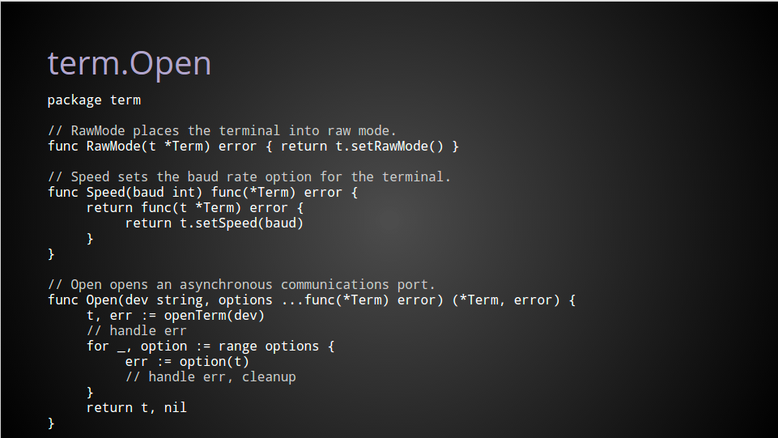

## 函数式选项模式（Functional Options Pattern）

函数式选项模式是一种在 Go 中构造结构体的模式，它通过设计一组非常有表现力和灵活的 API 来帮助配置和初始化结构体。

函数式选项模式一般应用在那些配置较多，且有可选参数的情况。

## 举例

``` go
type Server struct{
  host string
  port int
  timeout time.Duration
  maxConn int
}

func New(host string, port int) *Server {
  return &Server{host, port}
}

func (s *Server) Start() error {
}
```

如果要扩展 Server 的配置选项，如何做？通常有三种做法：

- 为每个不同的配置选项声明一个新的构造函数
- 使用专门的配置结构体来保存配置信息
- 使用 Functional Option Pattern

### 方式一：新的构造函数

这种方式配置较少且不太会变化的情况。

``` go
func NewWithTimeout(host string, port int, timeout time.Duration) *Server {
  return &Server{host, port, timeout}
}

func NewWithTimeoutAndMaxConn(host string, port int, timeout time.Duration, maxConn int) *Server {
  return &Server{host, port, timeout, maxConn}
}
```

### 方式二：使用专门的配置结构体来保存配置信息

这种方式也是很常见的，特别是当配置选项很多时。即使将来增加更多配置选项，也可以轻松的完成扩展，不会破坏 Server 的 API，但当增加或删除选项，需要对 Config 有较大的修改。

``` go
type Server struct{
  cfg Config
}

// 通常可以创建一个 Config 结构体，其中包含 Server 的所有配置选项。
type Config struct {
  Host string
  Port int
  Timeout time.Duration
  MaxConn int
}

func New(cfg Config) *Server {
  return &Server{cfg}
}
```

### 方式三：使用 Functional Option Pattern

使用这种方式将来增加选项，只需要增加对应的 WithXXX 函数即可。 这种模式，在第三方库中使用挺多，比如 [github.com/gocolly/colly](github.com/gocolly/colly)：

#### 声明

``` go
// Option 类型是一个函数类型，它接收一个参数：*Server
type Option func(*Server)

// 定义一系列相关返回 Option 的函数：
func WithHost(host string) Option {
  return func(s *Server) {
    s.host = host
  }
}

func WithPort(port int) Option {
  return func(s *Server) {
    s.port = port
  }
}

func WithTimeout(timeout time.Duration) Option {
  return func(s *Server) {
    s.timeout = timeout
  }
}

func WithMaxConn(maxConn int) Option {
  return func(s *Server) {
    s.maxConn = maxConn
  }
}

// Server 的构造函数接收一个 Option 类型的不定参数
func New(options ...Option) *Server {
  svr := &Server{}
  for _, option := range options {
    option(svr)
  }
  return svr
}
```

#### 使用

``` go
package main

import (
  "log"
  "server"
)

func main() {
  svr := New(
    WithHost("localhost"),
    WithPort(8080),
    WithTimeout(time.Minute),
    WithMaxConn(120),
  )
  if err := svr.Start(); err != nil {
    log.Fatal(err)
  }
}
```

Uber 的 Go 语言编程规范中提到该模式时，建议定义一个 Option 接口，而不是 Option 函数类型。

``` go
type options struct {
  cache  bool
  logger *zap.Logger
}

type Option interface {
  apply(*options)
}

type cacheOption bool

func (c cacheOption) apply(opts *options) {
  opts.cache = bool(c)
}

func WithCache(c bool) Option {
  return cacheOption(c)
}

type loggerOption struct {
  Log *zap.Logger
}

func (l loggerOption) apply(opts *options) {
  opts.logger = l.Log
}

func WithLogger(log *zap.Logger) Option {
  return loggerOption{Log: log}
}

// Open creates a connection.
func Open(
  addr string,
  opts ...Option,
) (*Connection, error) {
  options := options{
    cache:  defaultCache,
    logger: zap.NewNop(),
  }

  for _, o := range opts {
    o.apply(&options)
  }

  // ...
}
```

### 已有项目改进





### 参考

- [Uber Functional Options](https://github.com/uber-go/guide/blob/master/style.md#functional-options)
- [functional-options-for-friendly-apis](https://dave.cheney.net/2014/10/17/functional-options-for-friendly-apis)
