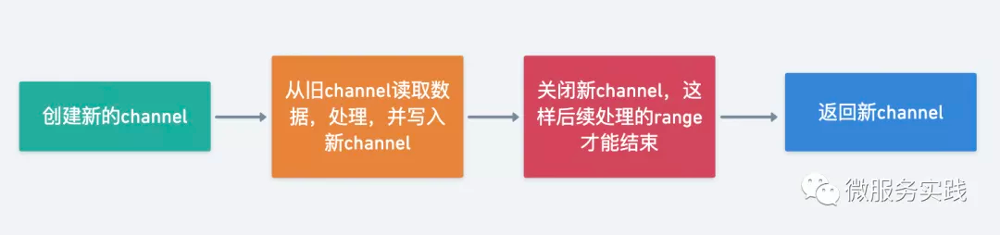

### 流处理

Stream 能让我们支持链式调用和函数编程的风格来实现数据的处理，看起来数据像是在流水线一样不断的实时流转加工，最终被汇总。Stream 的实现思想就是将数据处理流程抽象成了一个数据流，每次加工后返回一个新的流供使用。

``` go

int sum = widgets.stream()
              .filter(w -> w.getColor() == RED)
              .mapToInt(w -> w.getWeight())
              .sum();
```

### API 定义

Stream 的工作流程其实也属于生产消费者模型，整个流程跟工厂中的生产流程非常相似，尝试先定义一下 Stream 的生命周期：

- 创建阶段/数据获取（原料）
- 加工阶段/中间处理（流水线加工） 
- 汇总阶段/终结操作（最终产品）

下面围绕 stream 的三个生命周期开始定义 API：

#### 创建阶段 API

``` go
// 通过 channel 创建 stream
func Range(source <-chan interface{}) Stream

// 通过可变参数模式创建 stream
func Just(items ...interface{}) Stream

// 通过函数创建 stream
func From(generate GenerateFunc) Stream

```
 
#### 加工阶段 API

``` go
  // 去除重复item
  Distinct(keyFunc KeyFunc) Stream
  // 按条件过滤item
  Filter(filterFunc FilterFunc, opts ...Option) Stream
  // 分组
  Group(fn KeyFunc) Stream
  // 返回前n个元素
  Head(n int64) Stream
  // 返回后n个元素
  Tail(n int64) Stream
  // 获取第一个元素
  First() interface{}
  // 获取最后一个元素
  Last() interface{}
  // 转换对象
  Map(fn MapFunc, opts ...Option) Stream
  // 合并item到slice生成新的stream
  Merge() Stream
  // 反转
  Reverse() Stream
  // 排序
  Sort(fn LessFunc) Stream
  // 作用在每个item上
  Walk(fn WalkFunc, opts ...Option) Stream
  // 聚合其他Stream
  Concat(streams ...Stream) Stream
``` 

#### 汇总阶段 API

``` go
  // 检查是否全部匹配
  AllMatch(fn PredicateFunc) bool
  // 检查是否存在至少一项匹配
  AnyMatch(fn PredicateFunc) bool
  // 检查全部不匹配
  NoneMatch(fn PredicateFunc) bool
  // 统计数量
  Count() int
  // 清空stream
  Done()
  // 对所有元素执行操作
  ForAll(fn ForAllFunc)
  // 对每个元素执行操作
  ForEach(fn ForEachFunc)
```


### 设计实现

#### 如何实现链式调用

创建对象用到的 builder 模式可以达到链式调用效果。实际是每次调用完后都创建一个新的 Stream 返回给用户。

#### 如何实现流水线的处理效果

所谓的流水线可以理解为数据在 Stream 中的存储容器，在 go 中我们可以使用 channel 作为数据的管道，达到 Stream 链式调用执行多个操作时异步非阻塞效果。

#### 如何支持并行处理

数据加工本质上是在处理 channel 中的数据，那么要实现并行处理无非是并行消费 channel 而已，利用 goroutine 协程、WaitGroup 机制可以非常方便的实现并行处理。

核心逻辑是`利用 channel 当做管道，数据当做水流，不断的用协程接收/写入数据到 channel 中达到异步非阻塞的效果`，很难想象在 go 中 300 多行的代码就能实现如此强大的组件。

实现高效的基础来源三个语言特性：

- channel
- 协程
- 函数式编程



### [源码分析](https://mp.weixin.qq.com/s/t3INtSfFSmv-nsJqLmdPew)

#### Tail：使用环形切片去获取后 n 个元素

环形切片的特点：

- 支持自动滚动更新
- 节省内存 

利用环形切片在固定容量满的情况下旧数据不断被新数据覆盖的特点，可以用于读取 channel 后 n 个元素。

``` go
// 环形切片
type Ring struct {
  elements []interface{}
  index    int
  lock     sync.Mutex
}

func NewRing(n int) *Ring {
  if n < 1 {
    panic("n should be greather than 0")
  }
  return &Ring{
    elements: make([]interface{}, n),
  }
}

// 添加元素
func (r *Ring) Add(v interface{}) {
  r.lock.Lock()
  defer r.lock.Unlock()
  // 将元素写入切片指定位置
  // 这里的取余实现了循环写效果
  r.elements[r.index%len(r.elements)] = v
  // 更新下次写入位置
  r.index++
}

// 获取全部元素
// 读取顺序保持与写入顺序一致
func (r *Ring) Take() []interface{} {
  r.lock.Lock()
  defer r.lock.Unlock()

  var size int
  var start int
  // 当出现循环写的情况时
  // 开始读取位置需要通过去余实现,因为我们希望读取出来的顺序与写入顺序一致
  if r.index > len(r.elements) {
    size = len(r.elements)
    // 因为出现循环写情况,当前写入位置index开始为最旧的数据
    start = r.index % len(r.elements)
  } else {
    size = r.index
  }
  elements := make([]interface{}, size)
  for i := 0; i < size; i++ {
    // 取余实现环形读取,读取顺序保持与写入顺序一致
    elements[i] = r.elements[(start+i)%len(r.elements)]
  }

  return elements
}

func (s Stream) Tail(n int64) Stream {
  if n < 1 {
    panic("n must be greather than 1")
  }
  source := make(chan interface{})
  go func() {
    ring := collection.NewRing(int(n))
    // 读取全部元素，如果数量>n环形切片能实现新数据覆盖旧数据
    // 保证获取到的一定最后n个元素
    for item := range s.source {
      ring.Add(item)
    }
    for _, item := range ring.Take() {
      source <- item
    }
    close(source)
  }()
  return Range(source)
}
```

#### 为什么获取 s.source 时用切片来接收呢? 切片会自动扩容，用数组不是更好吗?

其实这里是不能用数组的，因为不知道 Stream 写入 source 的操作往往是在协程异步写入的，每个 Stream 中的 channel 都可能在动态变化，用流水线来比喻 Stream 工作流程的确非常形象。

